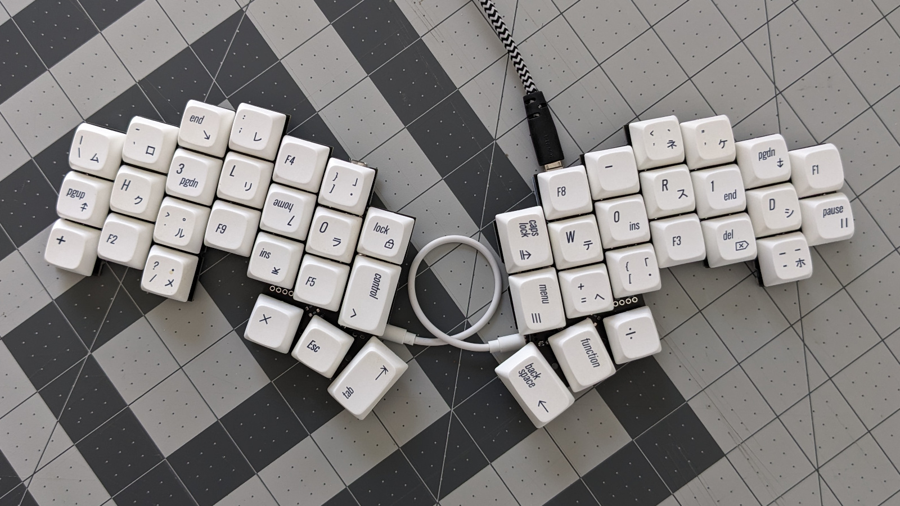
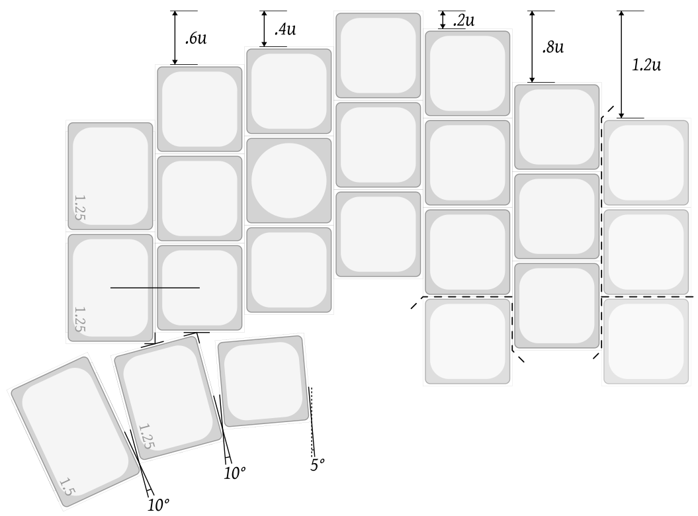
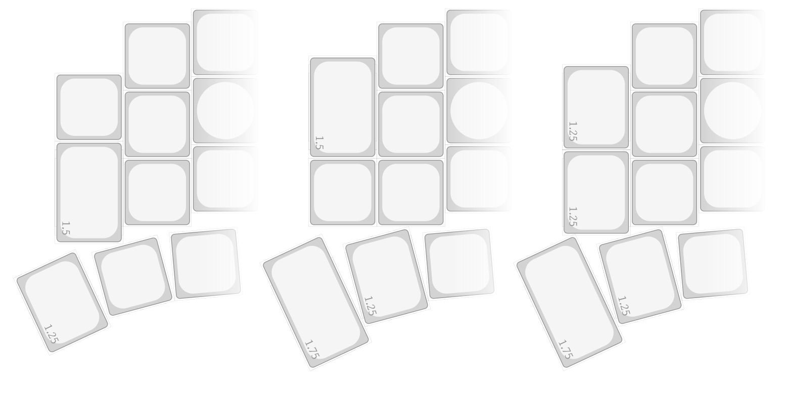
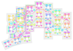

# Cubichnia Keyboard

A minimalist, column staggered, split keyboard with no visible top-side components.

## Form Factor

Physical layout is MX-spaced 3×6+3 with: 
- an extra 2-key inner column
- optional 6th column
- optional bottom key on 6th column 
- optional 4th key on 4th column 

The thumb cluster is designed for 1.5u, 1.25u, 1u keycaps
and the inner column for two 1.25u keycaps.
However the spacing allows for a few additional variations.

## PCB

The reversible PCB is based on Pro Micro compatible daughterboard
and has both MX and Khail Choc switch footprints.
It does not support hotwap sockets, LEDs, nor displays,
but does have battery pads and power switch pads for wireless builds.
Diodes and resistors are surface mount, respectively `SOD-123` and `1206` form-factors.

## Firmware

- [ZMK shield](firmware/zmk-shield/)
- [QMK keyboard](firmware/qmk-keyboard/)
